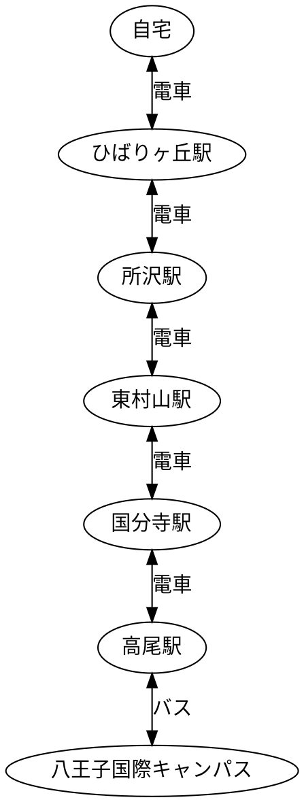

# 　矢島の通学経路

[メンバー表に戻る](member.md#メンバー表)

```graphviz
digraph {
    edge [dir=both]
    
    自宅 -> ひばりヶ丘駅[label=電車]
    ひばりヶ丘駅 -> 所沢駅[label=電車]
    所沢駅 -> 東村山駅[label=電車]
    東村山駅 -> 国分寺駅[label=電車]
    国分寺駅 -> 高尾駅[label=電車]
    高尾駅 -> 八王子国際キャンパス[label=バス]
}
```
